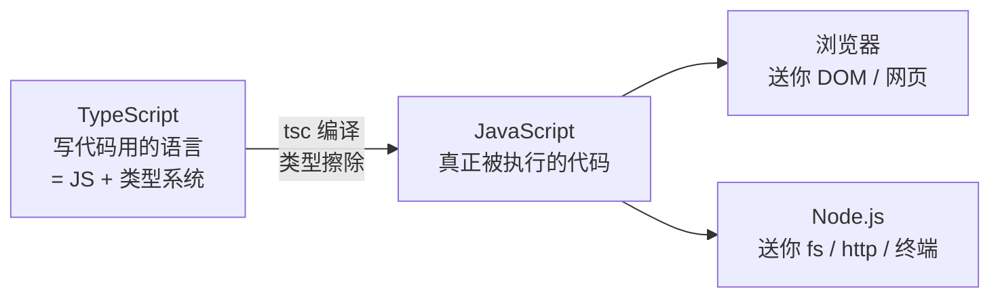
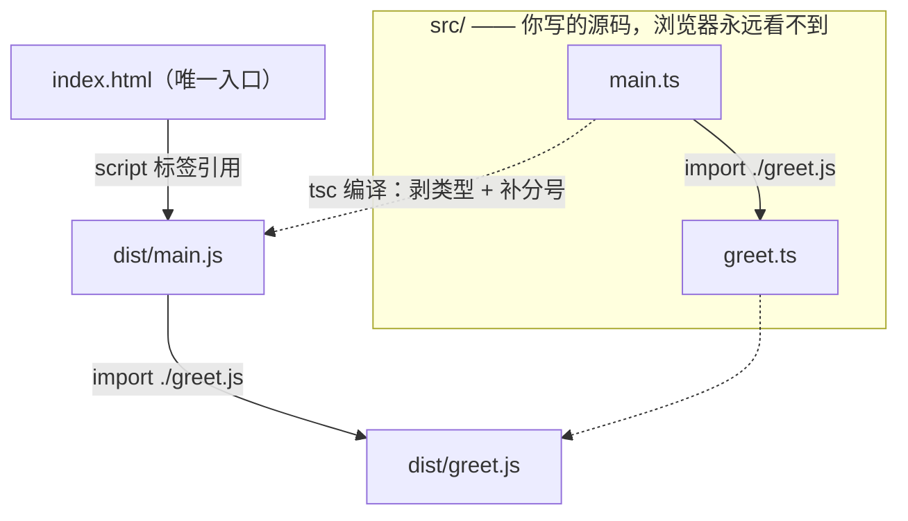
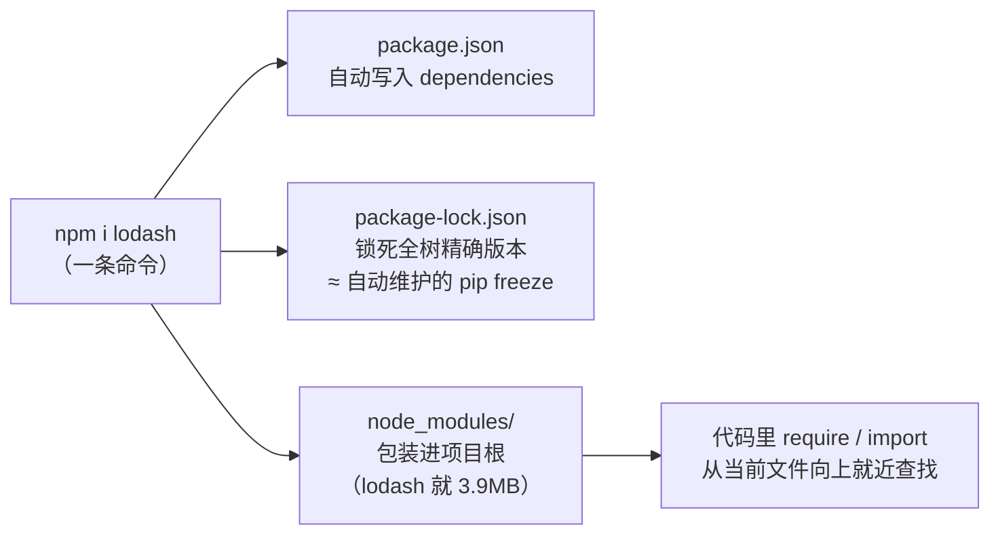
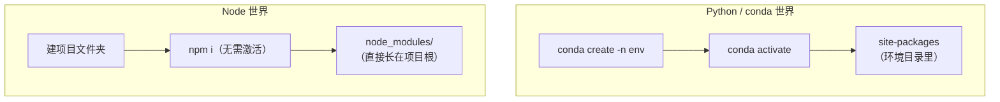
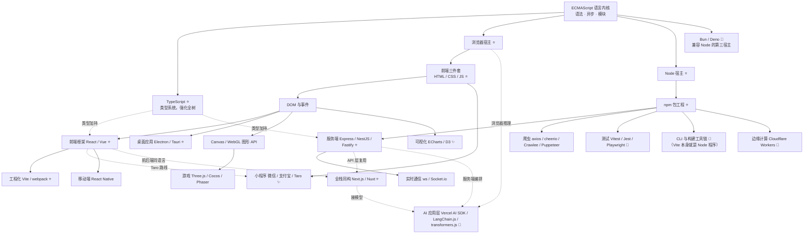
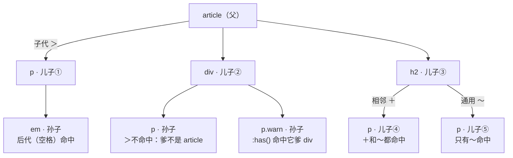

# 前端整合笔记：TS/JS 语言 · 生态路线图 · CSS 选择器

> 📌 2026-10-05 整合 · 三份独立笔记合而为一（内容原样保留，仅标题层级整体降一级）：
> 《TypeScript与JavaScript》→ 第一部分 · 《JavaScript技术路线图》→ 第二部分 · 《CSS选择器关系》→ 第三部分
> 配套：本目录《用户画像_协作偏好.md》（协作画像）· `Desktop\demo\whale-src`（实战标本）· `Desktop\demo\ts_html_demo`（演示项目）

---

## 第一部分 · 语言、运行时与工程（原《TypeScript与JavaScript》）

> 📝 整理自 2026-10-04 与 AI 助手的讨论（只收自己感兴趣的部分）
> 本部分含 **Mermaid 架构图**，VSCode 需装 *Markdown Preview Mermaid Support* 扩展才能渲染（已装好）

### 0. 一张图记住三者关系



> **一句话**：TypeScript 是"带类型外挂的 JavaScript"，Node.js 是"让 JS 脱离浏览器跑起来的运行时"。写的是 TS，跑的是 JS。

| 东西 | 身份 | 要点 |
|---|---|---|
| JavaScript | **语言** | 1995 年为浏览器生，动态类型；语言标准叫 **ECMAScript** |
| Node.js | **运行时** | = Chrome 的 JS 引擎 **V8** + libuv（事件循环/异步 IO）+ fs、http 等内置模块 |
| TypeScript | **语言 + 编译期类型系统** | 微软出品（C# 之父 Anders Hejlsberg）；任何合法 JS 都是合法 TS |

**类比锚点**：JavaScript : Node.js ≈ Python : CPython——语言 vs "让语言跑起来并送你标准库的东西"。浏览器是"另一个 CPython"：同一语言，但送的不是 `os/sys` 而是 `document/DOM`。

---

### 1. 类型擦除：类型只活在编译期

实测（`Desktop\demo\ts_demo.ts`，故意把 `number` 传成字符串）：

| 视角 | 命令 | 结果 |
|---|---|---|
| **运行时**（Node 24 直接跑 .ts） | `node ts_demo.ts` | ✅ 打印 `12` —— 类型标注被剥掉，JS 的 `+` 把 1 和 "2" 拼接 |
| **编译期**（tsc 检查） | `tsc --noEmit ts_demo.ts` | ❌ `error TS2345: string 不能赋给 number`，退出码 1 |

> **结论**：TS 类型**零运行时开销**（编译产物里一个类型的影子都没有），代价是**运行时不会救你**——类型错误全靠编译期和 IDE 拦。所以 TS 项目 CI 必开 `tsc --noEmit`。

Node 24 原生支持直接跑 `.ts`（运行时剥类型），但仅限"可擦除语法"；`enum` 这类会生成代码的特性仍需 tsc 编译。

---

### 2. HTML · JS · TS 的调用关系



**核心规律：HTML 永远只调用 `.js`（`<script>` 标签），从不直接调用 `.ts`。**

- `.ts` 写在 `src/`，编译产物 `.js` 落在 `dist/`——HTML 只碰 dist
- TS 里 import 却写 `.js` 后缀（`from "./greet.js"`）：**编译期** tsc 拿它找到 `greet.ts` 做类型检查，**运行时**它就是真文件名
- TS 之间的调用关系在编译期解决，JS 之间的调用关系在运行时发生

**这就是一个 C 项目**：`main()` ≈ `<script>` 入口 · `.c` ≈ `src/*.ts` · `.o/.exe` ≈ `dist/*.js` · gcc ≈ tsc · CMake ≈ Vite。

**仓库里通常只有 .ts**（"写 TS、跑 JS"的三种形态）：

| 形态 | 仓库放什么 | JS 产物去哪 |
|---|---|---|
| 经典网页 | `src/*.ts` | `dist/` 构建时生成，一般 `.gitignore` 掉（≈ 不提交 .exe） |
| Vite 项目 | 只有源码 | `dist` 仓库里根本不存在，`npm run build` 发布时才落盘 |
| npm 库 | TS 源码（不发布） | 发布**编译后的 .js + `.d.ts` 类型声明**——**.d.ts 就是 .h 头文件** |

> 凡是看到"HTML 直接引 TS"（Vite 开发模式），背后必有工具在内存里即时转译——浏览器收到的永远是 JS。

---

### 3. 包管理：npm（装 Node 自带）



```bash
npm init -y          # 初始化项目，生成 package.json
npm i lodash         # 装进"本项目"，自动记入 package.json
npm i -g typescript  # 装进全局 C:\nodejs\node_global（工具类，如 tsc）
npm run dev          # 执行 package.json 里 scripts 定义的命令
```

- `package.json` = **requirements.txt + Makefile 合体**：记依赖 + 定义脚本命令和入口
- `package-lock.json` 保证"陌生人 clone 后 `npm i` 重建出一模一样的环境"
- **`node_modules` 永远不进 git**；拿到任何 Node 项目第一步是 `npm i`
- 竞品 pnpm / yarn（大项目用 pnpm 省磁盘），起步 npm 够用；源已配 npmmirror 国内镜像

---

### 4. 包引入：require 与 import

引入来源三种，查找规则不同：

| 写法 | 找什么 | 规则 |
|---|---|---|
| `require('fs')` / `import fs from 'fs'` | Node **内置模块** | 不用装（fs/http/path…） |
| `require('lodash')` | **三方包** | 从当前文件向上逐级找 `node_modules/`（≈ sys.path 搜索） |
| `import {问好} from './greet.js'` | **本地文件** | 相对当前文件路径 |

两种语法是两代模块标准：`require`（CommonJS，Node 传统）vs `import`（ESM，现代标准）。**用哪套由 `package.json` 的 `"type": "module"` 决定**。同一包两种语法都能引（实测 lodash 均通过）。

---

### 5. 环境管理：没有 conda activate

**Node 只有一份全局解释器（`C:\nodejs\node.exe`），不存在"创建/激活环境"**——隔离靠约定：每个项目依赖装进自己文件夹的 `node_modules/`，npm 就近解析。venv 的活儿被"目录约定"替代了。



| 你熟的 Python/conda | Node 世界 |
|---|---|
| conda create -n + activate | **没有对应物** |
| venv 的 site-packages | `node_modules/`（长在项目根） |
| requirements.txt（手维护） | package.json（npm 自动写入） |
| pip freeze 导出锁版 | package-lock.json（自动生成维护） |
| conda 管多版本 Python | **nvm-windows / fnm / volta**（管不到包） |
| conda base 里的 CLI 工具 | `npm i -g`（tsc 就在 C:\nodejs\node_global） |

---

### 6. 实战标本：一只 17294 行的鲸鱼挂件

[DeepSeek-Balance-Whale-Widget](https://github.com/MeteorNOX/DeepSeek-Balance-Whale-Widget) —— DSH（DeepSeek Harness）的第三方插件，右下角鲸鱼娘盯 DeepSeek 余额。三个 JS 文件正好是本文全部概念的活标本：

| 文件 | 跑在哪 | 干什么 |
|---|---|---|
| `lib/index.js` | Node 宿主侧 | 注册 HTTP 路由、监听会话事件记账、管 API key 凭据 |
| `lib/accounting.mjs` | Node 宿主侧 | 记账内核：**金额全用整数定点（×10⁸）**——C 程序员的本能：浮点不能存钱；无交易接口就用余额快照差分（下降=消费，上升=充值） |
| `assets/whale-widget.js` | 浏览器侧 | 17294 行零框架 vanilla JS：DOM 注入 + 60 秒轮询 + 凸包命中检测 + Web Audio |

源码已下载在 `Desktop\demo\whale-src\`，可对照阅读。

---

## 第二部分 · JS 生态路线图（原《JavaScript技术路线图》）

> 📌 2026-10-04 整理 · 视角：**JS 生态的应用方向全景**——节点 = 技术；**实线 = 硬前置**（点后面前置得先点），**虚线 = 生态 / 增益 / 可选路线**。
> 图例：⭐ 主流大分支 · ✨ 国内特色 · 🔧 工具属性 · 🧪 新兴/上升期
> 配套：第一部分（语言与运行时）· `demo\whale-src`（实战标本）

### 一、总树



### 二、浏览器宿主分支（一切"给人看的界面"）

| 节点 | 前置 | 内容与代表 | 热度 |
|---|---|---|---|
| 前端三件套 | 语言内核 | HTML 结构 / CSS 样式 / JS 行为——所有分支的地基 | ⭐ |
| DOM 与事件 | 三件套 | 页面元素的增删改查与交互；SPA 之前的全部 | ⭐ |
| 前端框架 | DOM | React / Vue / Svelte——组件化开发事实标准；状态管理（Pinia / Zustand / Redux）属其生态 | ⭐ |
| 工程化 | 框架 | Vite / webpack / TS 编译——现代前端的流水线 | ⭐ |
| 桌面应用 | DOM（框架加分） | Electron（VS Code、Discord）/ Tauri（Rust 壳更轻） | ⭐ |
| 小程序 | 三件套（Taro 路线再加框架） | 微信 / 支付宝 / 抖音；Taro、uni-app 一套多端 | ✨ 国内特有大生态 |
| 移动端 | 框架 | React Native / Expo | 体量中等 |
| 游戏 | Canvas / WebGL（GFX 节点） | Three.js（3D）/ Cocos（小游戏）/ Phaser（2D） | 细分稳定 |
| 可视化 | DOM | ECharts（国内大屏标配）/ D3 | ✨ 国内需求旺盛 |

### 三、Node 宿主分支（一切"不给人看的服务"）

| 节点 | 前置 | 内容与代表 | 热度 |
|---|---|---|---|
| npm 包工程 | 语言内核 | package.json / 依赖管理——本分支的地基 | ⭐ |
| 服务端框架 | npm | Express（≈Flask）/ NestJS（≈Spring）/ Fastify | ⭐ |
| 实时通信 | 服务端 | ws / Socket.io——聊天、协作、流式输出 | 常用 |
| 测试 | npm | Vitest（单元/组件）/ Playwright（浏览器 E2E） | 🔧 |
| 爬虫 | npm | fetch（内置）/ axios / cheerio / Crawlee / Puppeteer（驱动真浏览器） | 常用 |
| CLI 与工具链 | npm | commander 等脚手架；**整个前端工具链（Vite/esbuild）本身就是 Node 程序** | 🔧 |
| 边缘计算 | 服务端 | Cloudflare Workers / Vercel Edge——V8 跑在离用户最近的节点 | 🧪 上升期 |

### 四、横跨宿主与特殊节点

| 节点 | 连接什么 | 说明 |
|---|---|---|
| **TypeScript** ⭐ | 强化全树 | 不是分支，是全树加类型 Buff；现代项目默认起点 |
| **全栈同构** ⭐ | 前端 ↔ Node | Next.js / Nuxt——前后端同一门语言一套工程，当前最大趋势 |
| **AI 应用层** 🧪 | 浏览器 / Node / 全栈 → 模型 | Vercel AI SDK / LangChain.js / transformers.js（浏览器里直接跑小模型，WebGPU 推理）——JS 独有、Python 做不了的方向 |
| Web 标准 API | 两宿主 | fetch / URL / TextEncoder——跨宿主通用语，写一次两边跑 |
| **第三宿主 Bun / Deno** 🧪 | 语言内核 | 与 Node 平级的运行时：Bun 兼容 Node API、工具链正向它迁移；Deno 独立安全模型 |

### 五、点树顺序速查（想做什么 → 前置链）

| 目标 | 需要点亮的链 |
|---|---|
| 做网站/管理后台 | 内核 → 三件套 → DOM → 框架 → 工程化 |
| 做 API 服务/后端 | 内核 → npm → 服务端框架 |
| 做桌面 exe | 网站全链 → Electron |
| 做小程序 | 三件套（轻量）→ 框架 → Taro/原生 |
| 做爬虫 | 内核 → npm → fetch/cheerio；（强反爬）→ Puppeteer |
| 做数据大屏 | 网站链 → ECharts |
| 做实时聊天/Agent 界面 | 服务端（+ws）↔ 前端（fetch/WS）→ 可选 Next.js |
| 做浏览器端 AI | 网站链 → transformers.js |

### 六、与相邻科技树的边界

| 邻树 | 分工 |
|---|---|
| Python | 模型训练 / 科学计算 / 数据处理（JS 不碰计算层） |
| C / Rust | 固件 / 系统 / 高性能底层（JS 是"人和界面、人和服务"之间那层） |
| Go / Java | 高并发后端大系统（Node 单线程模型在重计算场景让位） |

---

## 第三部分 · CSS 选择器关系（原《CSS选择器关系》）

> 📌 2026-10-05 整理 · 视角：**组合器 = DOM 树的亲戚读法**——先画树，再读关系，方向永远从右往左。
> 图例：⭐ 必背主力 · 🔧 场景工具 · 🧪 新特性（2023 年落地）
> 配套：第二部分（路线图前端三件套分支）· 第七节 demo 存为 html 双击即可验证

### 一、总图：一棵 DOM 树，边上标着走法



读图规则：**箭头方向 = CSS 能不能"看过去"**。CSS 的目光默认自上而下、从左往右——爹可以选儿子、哥哥可以选弟弟；反向（看儿子选爹）只有 `:has()` 一条路。

### 二、树上的三种基本关系（地基）

| 关系 | 定义 | 关键区别 |
|---|---|---|
| 祖先 ↔ 后代 | 树上"在上面"的一切节点 | **隔多少层都算** |
| 父 ↔ 子 | 直接相邻的上下两层 | **只算一层**，孙辈不算 |
| 兄弟 | 同一个爹 | 只看"谁在谁后面" |

先钉一个概念坑：日常说的"父选择器 `A > B`"其实选的是**子**——命中并上样式的是 B，A 只是条件。真正的"看儿子选爹"是第五节的 `:has()`。

### 三、组合器主力 ⭐

| 组合器 | 写法 | 读法（从右往左） | 选中谁 |
|---|---|---|---|
| 后代 | `A B`（空格） | "A 的后代里的 B" | A 里面**所有层**的 B，孙辈也算 |
| 子代 | `A > B` | "A 的亲儿子 B" | 只选 A **直接下一层**的 B |
| 相邻兄弟 | `A + B` | "紧跟 A 的那个 B" | 同级、**紧挨着**的第一个 B |
| 通用兄弟 | `A ~ B` | "A 后面所有同级 B" | 同级、A **之后**的所有 B（不必相邻） |

三条共同规则：

1. **从右往左读**——右边是主角（被选中的），左边全是条件；这恰好也是浏览器的真实匹配顺序；
2. 交集（同时满足）无空格连写：`p.warn` = "p 标签且有 warn 类"；
3. 组合器本身**不加优先级**，specificity 只数 A、B 各自的 id / class / 标签。

### 四、两场最易混的对决

#### 后代 `空格` vs 子代 `>`

```css
article em  { color: red; }              /* 孙子辈的 em 照样中 —— 血脉认定 */
article > p { border-left: 3px solid steelblue; }  /* 孙子里的 p 不中 —— 亲子鉴定 */
```

对照总图：`article em` 命中儿子①里的 em（隔两层）；`article > p` 只命中儿子①，div 里的两个孙辈 p 落选。

#### 相邻 `+` vs 通用 `~`

```css
h2 + p { color: gray; }       /* 只有紧挨 h2 的儿子④ */
h2 ~ p { background: #f2f2f2; } /* 儿子④⑤全中 */
```

- `+` = 单点："标题下面的导语"；
- `~` = 范围："标题之后的所有正文"；
- 兄弟**只往后找**——`:has()` 出现之前，CSS 没有"前一个兄弟"。

### 五、真·父选择器 `:has()` 🧪

```css
div:has(.warn) { outline: 2px solid tomato; }  /* 里面有 .warn 的 div，红框在爹身上 */
p:has(img) { padding: 8px; }                   /* 有图的段落 */
form:has(input:invalid) { border-color: red; } /* 招牌用法：表单有非法输入，整框标红 */
li:has(+ .active) { border-bottom: none; }     /* 反向：选中"后面跟着 .active 的 li"，
                                                  补上 CSS 缺失的'前一个兄弟' */
```

- 语义 ≈ "B 的爹/祖先 A"，目光第一次可以**从下往上**走；
- 是**开销最大**的选择器，高频重排的页面别滥用；
- 兼容性：Chrome/Edge 105+ · Safari 15.4+ · Firefox 121+，2026 年可放心用。

### 六、按位置选亲戚：结构伪类 🔧

不写第二个选择器，按**兄弟排位**下手：

| 写法 | 含义 |
|---|---|
| `:first-child` / `:last-child` | 第一个 / 最后一个儿子 |
| `:nth-child(n)` | 排第 n 个儿子（从 1 数） |
| `:nth-child(odd / even)` | 奇 / 偶（斑马纹专用） |
| `:nth-child(3n+1)` | 第 1、4、7…个（an+b 循环公式） |
| `:nth-of-type(n)` | 同标签类型里的第 n 个（兄弟标签混杂时用） |

### 七、可跑 Demo（存成 demo.html 双击）

```html
<!DOCTYPE html>
<html lang="zh">
<head>
<meta charset="UTF-8">
<title>选择器关系 demo</title>
<style>
  article em { color: red; }                       /* 后代 */
  article > p { border-left: 4px solid steelblue; } /* 子代 */
  h2 + p { color: gray; }                          /* 相邻兄弟 */
  h2 ~ p { background: #f2f2f2; }                  /* 通用兄弟 */
  div:has(.warn) { outline: 2px solid tomato; }    /* 父选择器 */
  li:nth-child(odd) { background: #e8f0fe; }       /* 结构伪类 */
</style>
</head>
<body>
  <article>
    <p>亲儿子段落，里面有个 <em>后代 em</em></p>
    <div>
      <p>孙子段落：这里的 p 不是 article 的子代（没蓝边）</p>
      <p class="warn">警告：我在孙子辈，但我所在的 div 被标红了</p>
    </div>
    <h2>标题</h2>
    <p>紧跟标题的第一个兄弟（灰字 + 底色）</p>
    <p>标题后面的第二个兄弟（只有底色）</p>
  </article>
  <ul>
    <li>第 1 行（有底色）</li>
    <li>第 2 行</li>
    <li>第 3 行（有底色）</li>
    <li>第 4 行</li>
  </ul>
</body>
</html>
```

### 八、速查表 + 与 JS 的连接

| 需求 | 写法 |
|---|---|
| 选 A 里面所有 B | `A B` |
| 只选亲儿子 | `A > B` |
| 紧跟 A 的那个 B | `A + B` |
| A 后面所有同级 B | `A ~ B` |
| 因为有 B 所以选 A（选爹） | `A:has(B)` |
| 第 n / 奇偶 / 循环个儿子 | `:nth-child(...)` |
| 交集（同时满足） | `p.warn` |
| 并集（满足其一） | `A, B` |

`querySelector` 用的就是这套语法，学一遍两边用：

```js
document.querySelector("article > p");     // 第一个亲儿子段落
document.querySelectorAll("h2 ~ p");       // h2 后面所有兄弟段落
document.querySelector("div:has(.warn)");  // 那个被标红的爹
```

### 九、点树顺序（按需求找写法）

| 你想干什么 | 直达写法 |
|---|---|
| 整块内容统一风格 | 后代 `A B` |
| 只管直接结构（防穿透） | 子代 `A > B` |
| 标题下的导语 | 相邻 `h2 + p` |
| 标题后的所有正文 | 通用 `h2 ~ p` |
| 子元素出问题、爹变色 | `:has()` 🧪 |
| 列表斑马纹 / 首尾特判 | `:nth-child` / `:first-child` |

**一句话收拢**：组合器 = DOM 树的读法——空格是血脉（所有后代）、`>` 是亲子（仅一层）、`+` 是下一个、`~` 是后面所有、`:has()` 是反向认亲。写选择器前先画树，方向从右往左：左边全是条件，右边才是主角。

---

*2026-10-05 整合自三份独立笔记（git 历史可查原文）；内容有变直接改本文件对应部分。*
