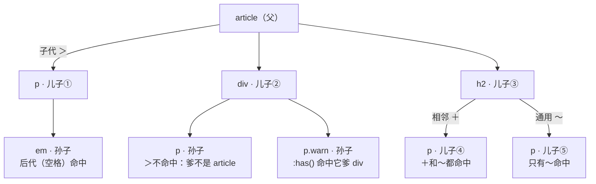

# CSS 选择器关系图谱

> 📌 2026-10-05 整理 · 视角：**组合器 = DOM 树的亲戚读法**——先画树，再读关系，方向永远从右往左。
> 图例：⭐ 必背主力 · 🔧 场景工具 · 🧪 新特性（2023 年落地）
> 配套：《JavaScript技术路线图.md》前端三件套分支 · 第七节 demo 存为 html 双击即可验证

---

## 一、总图：一棵 DOM 树，边上标着走法



读图规则：**箭头方向 = CSS 能不能"看过去"**。CSS 的目光默认自上而下、从左往右——爹可以选儿子、哥哥可以选弟弟；反向（看儿子选爹）只有 `:has()` 一条路。

## 二、树上的三种基本关系（地基）

| 关系 | 定义 | 关键区别 |
|---|---|---|
| 祖先 ↔ 后代 | 树上"在上面"的一切节点 | **隔多少层都算** |
| 父 ↔ 子 | 直接相邻的上下两层 | **只算一层**，孙辈不算 |
| 兄弟 | 同一个爹 | 只看"谁在谁后面" |

先钉一个概念坑：日常说的"父选择器 `A > B`"其实选的是**子**——命中并上样式的是 B，A 只是条件。真正的"看儿子选爹"是第五节的 `:has()`。

## 三、组合器主力 ⭐

| 组合器 | 写法 | 读法（从右往左） | 选中谁 |
|---|---|---|---|
| 后代 | `A B`（空格） | "A 的后代里的 B" | A 里面**所有层**的 B，孙辈也算 |
| 子代 | `A > B` | "A 的亲儿子 B" | 只选 A **直接下一层**的 B |
| 相邻兄弟 | `A + B` | "紧跟 A 的那个 B" | 同级、**紧挨着**的第一个 B |
| 通用兄弟 | `A ~ B` | "A 后面所有同级 B" | 同级、A **之后**的所有 B |

三条共同规则：

1. **从右往左读**——右边是主角（被选中的），左边全是条件；这恰好也是浏览器的真实匹配顺序；
2. 交集（同时满足）无空格连写：`p.warn` = "p 标签且有 warn 类"；
3. 组合器本身**不加优先级**，specificity 只数 A、B 各自的 id / class / 标签。

## 四、两场最易混的对决

### 后代 `空格` vs 子代 `>`

```css
article em  { color: red; }              /* 孙子辈的 em 照样中 —— 血脉认定 */
article > p { border-left: 3px solid steelblue; }  /* 孙子里的 p 不中 —— 亲子鉴定 */
```

对照总图：`article em` 命中儿子①里的 em（隔两层）；`article > p` 只命中儿子①，div 里的两个孙辈 p 落选。

### 相邻 `+` vs 通用 `~`

```css
h2 + p { color: gray; }       /* 只有紧挨 h2 的儿子④ */
h2 ~ p { background: #f2f2f2; } /* 儿子④⑤全中 */
```

- `+` = 单点："标题下面的导语"；
- `~` = 范围："标题之后的所有正文"；
- 兄弟**只往后找**——`:has()` 出现之前，CSS 没有"前一个兄弟"。

## 五、真·父选择器 `:has()` 🧪

```css
div:has(.warn) { outline: 2px solid tomato; }  /* 里面有 .warn 的 div，红框在爹身上 */
p:has(img) { padding: 8px; }                   /* 有图的段落 */
form:has(input:invalid) { border-color: red; } /* 招牌用法：表单有非法输入，整框标红 */
li:has(+ .active) { border-bottom: none; }     /* 反向：选中"后面跟着 .active 的 li"，
                                                  补上 CSS 缺失的'前一个兄弟' */
```

- 语义 ≈ "B 的爹/祖先 A"，目光第一次可以**从下往上**走；
- 是**开销最大**的选择器，高频重排的页面别滥用；
- 兼容性：Chrome/Edge 105+ · Safari 15.4+ · Firefox 121+，2026 年可放心用。

## 六、按位置选亲戚：结构伪类 🔧

不写第二个选择器，按**兄弟排位**下手：

| 写法 | 含义 |
|---|---|
| `:first-child` / `:last-child` | 第一个 / 最后一个儿子 |
| `:nth-child(n)` | 排第 n 个儿子（从 1 数） |
| `:nth-child(odd / even)` | 奇 / 偶（斑马纹专用） |
| `:nth-child(3n+1)` | 第 1、4、7…个（an+b 循环公式） |
| `:nth-of-type(n)` | 同标签类型里的第 n 个（兄弟标签混杂时用） |

## 七、可跑 Demo（存成 demo.html 双击）

```html
<!DOCTYPE html>
<html lang="zh">
<head>
<meta charset="UTF-8">
<title>选择器关系 demo</title>
<style>
  article em { color: red; }                       /* 后代 */
  article > p { border-left: 4px solid steelblue; } /* 子代 */
  h2 + p { color: gray; }                          /* 相邻兄弟 */
  h2 ~ p { background: #f2f2f2; }                  /* 通用兄弟 */
  div:has(.warn) { outline: 2px solid tomato; }    /* 父选择器 */
  li:nth-child(odd) { background: #e8f0fe; }       /* 结构伪类 */
</style>
</head>
<body>
  <article>
    <p>亲儿子段落，里面有个 <em>后代 em</em></p>
    <div>
      <p>孙子段落：这里的 p 不是 article 的子代（没蓝边）</p>
      <p class="warn">警告：我在孙子辈，但我所在的 div 被标红了</p>
    </div>
    <h2>标题</h2>
    <p>紧跟标题的第一个兄弟（灰字 + 底色）</p>
    <p>标题后面的第二个兄弟（只有底色）</p>
  </article>
  <ul>
    <li>第 1 行（有底色）</li>
    <li>第 2 行</li>
    <li>第 3 行（有底色）</li>
    <li>第 4 行</li>
  </ul>
</body>
</html>
```

## 八、速查表 + 与 JS 的连接

| 需求 | 写法 |
|---|---|
| 选 A 里面所有 B | `A B` |
| 只选亲儿子 | `A > B` |
| 紧跟 A 的那个 B | `A + B` |
| A 后面所有同级 B | `A ~ B` |
| 因为有 B 所以选 A（选爹） | `A:has(B)` |
| 第 n / 奇偶 / 循环个儿子 | `:nth-child(...)` |
| 交集（同时满足） | `p.warn` |
| 并集（满足其一） | `A, B` |

`querySelector` 用的就是这套语法，学一遍两边用：

```js
document.querySelector("article > p");     // 第一个亲儿子段落
document.querySelectorAll("h2 ~ p");       // h2 后面所有兄弟段落
document.querySelector("div:has(.warn)");  // 那个被标红的爹
```

## 九、点树顺序（按需求找写法）

| 你想干什么 | 直达写法 |
|---|---|
| 整块内容统一风格 | 后代 `A B` |
| 只管直接结构（防穿透） | 子代 `A > B` |
| 标题下的导语 | 相邻 `h2 + p` |
| 标题后的所有正文 | 通用 `h2 ~ p` |
| 子元素出问题、爹变色 | `:has()` 🧪 |
| 列表斑马纹 / 首尾特判 | `:nth-child` / `:first-child` |

---

**一句话收拢**：组合器 = DOM 树的读法——空格是血脉（所有后代）、`>` 是亲子（仅一层）、`+` 是下一个、`~` 是后面所有、`:has()` 是反向认亲。写选择器前先画树，方向从右往左：左边全是条件，右边才是主角。

*整理：2026-10-05 · 定性梳理 · 有变直接改本文件。*
