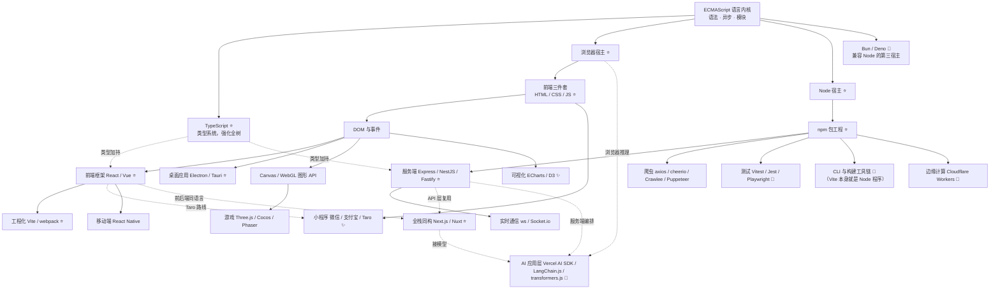

# JavaScript / TypeScript 科技树

> 📌 2026-10-04 整理 · 视角：**JS 生态的应用方向全景**——节点 = 技术；**实线 = 硬前置**（点后面前置得先点），**虚线 = 生态 / 增益 / 可选路线**。
> 图例：⭐ 主流大分支 · ✨ 国内特色 · 🔧 工具属性 · 🧪 新兴/上升期
> 配套：`TypeScript与JavaScript.md`（概念与宿主理论）· `demo\whale-src`（实战标本）

---

## 一、总树

---

## 二、浏览器宿主分支（一切"给人看的界面"）

| 节点 | 前置 | 内容与代表 | 热度 |
|---|---|---|---|
| 前端三件套 | 语言内核 | HTML 结构 / CSS 样式 / JS 行为——所有分支的地基 | ⭐ |
| DOM 与事件 | 三件套 | 页面元素的增删改查与交互；SPA 之前的全部 | ⭐ |
| 前端框架 | DOM | React / Vue / Svelte——组件化开发事实标准；状态管理（Pinia / Zustand / Redux）属其生态 | ⭐ |
| 工程化 | 框架 | Vite / webpack / TS 编译——现代前端的流水线 | ⭐ |
| 桌面应用 | DOM（框架加分） | Electron（VS Code、Discord）/ Tauri（Rust 壳更轻） | ⭐ |
| 小程序 | 三件套（Taro 路线再加框架） | 微信 / 支付宝 / 抖音；Taro、uni-app 一套多端 | ✨ 国内特有大生态 |
| 移动端 | 框架 | React Native / Expo | 体量中等 |
| 游戏 | Canvas / WebGL（GFX 节点） | Three.js（3D）/ Cocos（小游戏）/ Phaser（2D） | 细分稳定 |
| 可视化 | DOM | ECharts（国内大屏标配）/ D3 | ✨ 国内需求旺盛 |

## 三、Node 宿主分支（一切"不给人看的服务"）

| 节点 | 前置 | 内容与代表 | 热度 |
|---|---|---|---|
| npm 包工程 | 语言内核 | package.json / 依赖管理——本分支的地基 | ⭐ |
| 服务端框架 | npm | Express（≈Flask）/ NestJS（≈Spring）/ Fastify | ⭐ |
| 实时通信 | 服务端 | ws / Socket.io——聊天、协作、流式输出 | 常用 |
| 测试 | npm | Vitest（单元/组件）/ Playwright（浏览器 E2E） | 🔧 |
| 爬虫 | npm | fetch（内置）/ axios / cheerio / Crawlee / Puppeteer（驱动真浏览器） | 常用 |
| CLI 与工具链 | npm | commander 等脚手架；**整个前端工具链（Vite/esbuild）本身就是 Node 程序** | 🔧 |
| 边缘计算 | 服务端 | Cloudflare Workers / Vercel Edge——V8 跑在离用户最近的节点 | 🧪 上升期 |

## 四、横跨宿主与特殊节点

| 节点 | 连接什么 | 说明 |
|---|---|---|
| **TypeScript** ⭐ | 强化全树 | 不是分支，是全树加类型 Buff；现代项目默认起点 |
| **全栈同构** ⭐ | 前端 ↔ Node | Next.js / Nuxt——前后端同一门语言一套工程，当前最大趋势 |
| **AI 应用层** 🧪 | 浏览器 / Node / 全栈 → 模型 | Vercel AI SDK / LangChain.js / transformers.js（浏览器里直接跑小模型，WebGPU 推理）——JS 独有、Python 做不了的方向 |
| Web 标准 API | 两宿主 | fetch / URL / TextEncoder——跨宿主通用语，写一次两边跑 |
| **第三宿主 Bun / Deno** 🧪 | 语言内核 | 与 Node 平级的运行时：Bun 兼容 Node API、工具链正向它迁移；Deno 独立安全模型 |

---

## 五、点树顺序速查（想做什么 → 前置链）

| 目标 | 需要点亮的链 |
|---|---|
| 做网站/管理后台 | 内核 → 三件套 → DOM → 框架 → 工程化 |
| 做 API 服务/后端 | 内核 → npm → 服务端框架 |
| 做桌面 exe | 网站全链 → Electron |
| 做小程序 | 三件套（轻量）→ 框架 → Taro/原生 |
| 做爬虫 | 内核 → npm → fetch/cheerio；（强反爬）→ Puppeteer |
| 做数据大屏 | 网站链 → ECharts |
| 做实时聊天/Agent 界面 | 服务端（+ws）↔ 前端（fetch/WS）→ 可选 Next.js |
| 做浏览器端 AI | 网站链 → transformers.js |

---

## 六、与相邻科技树的边界

| 邻树 | 分工 |
|---|---|
| Python | 模型训练 / 科学计算 / 数据处理（JS 不碰计算层） |
| C / Rust | 固件 / 系统 / 高性能底层（JS 是"人和界面、人和服务"之间那层） |
| Go / Java | 高并发后端大系统（Node 单线程模型在重计算场景让位） |

*数据为定性分级（npm 下载量 / GitHub stars / 招聘体感），有变直接改本文件。*
