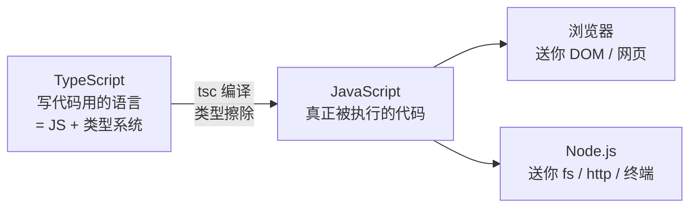
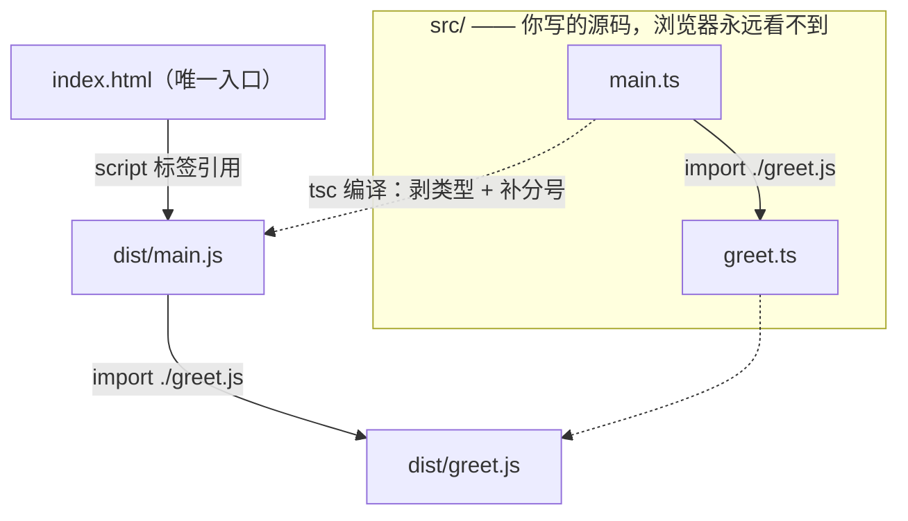
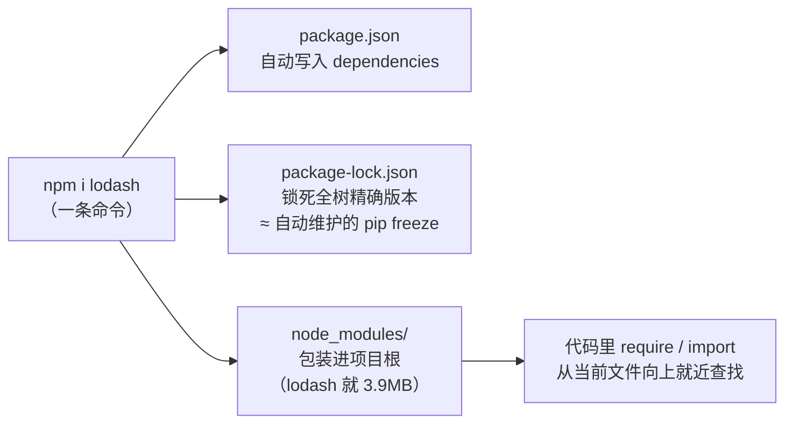
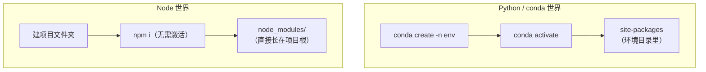

# TypeScript 与 JavaScript：语言、运行时与工程

> 📝 整理自 2026-10-04 与 AI 助手的讨论（只收自己感兴趣的部分）
> 配套演示项目：`Desktop\demo\ts_html_demo` · 实战源码标本：`Desktop\demo\whale-src`
> 本文件含 **Mermaid 架构图**，VSCode 需装 *Markdown Preview Mermaid Support* 扩展才能渲染（已装好）

---

## 0. 一张图记住三者关系



> **一句话**：TypeScript 是"带类型外挂的 JavaScript"，Node.js 是"让 JS 脱离浏览器跑起来的运行时"。写的是 TS，跑的是 JS。

| 东西 | 身份 | 要点 |
|---|---|---|
| JavaScript | **语言** | 1995 年为浏览器生，动态类型；语言标准叫 **ECMAScript** |
| Node.js | **运行时** | = Chrome 的 JS 引擎 **V8** + libuv（事件循环/异步 IO）+ fs、http 等内置模块 |
| TypeScript | **语言 + 编译期类型系统** | 微软出品（C# 之父 Anders Hejlsberg）；任何合法 JS 都是合法 TS |

**类比锚点**：JavaScript : Node.js ≈ Python : CPython——语言 vs "让语言跑起来并送你标准库的东西"。浏览器是"另一个 CPython"：同一语言，但送的不是 `os/sys` 而是 `document/DOM`。

---

## 1. 类型擦除：类型只活在编译期

实测（`Desktop\demo\ts_demo.ts`，故意把 `number` 传成字符串）：

| 视角 | 命令 | 结果 |
|---|---|---|
| **运行时**（Node 24 直接跑 .ts） | `node ts_demo.ts` | ✅ 打印 `12` —— 类型标注被剥掉，JS 的 `+` 把 1 和 "2" 拼接 |
| **编译期**（tsc 检查） | `tsc --noEmit ts_demo.ts` | ❌ `error TS2345: string 不能赋给 number`，退出码 1 |

> **结论**：TS 类型**零运行时开销**（编译产物里一个类型的影子都没有），代价是**运行时不会救你**——类型错误全靠编译期和 IDE 拦。所以 TS 项目 CI 必开 `tsc --noEmit`。

Node 24 原生支持直接跑 `.ts`（运行时剥类型），但仅限"可擦除语法"；`enum` 这类会生成代码的特性仍需 tsc 编译。

---

## 2. HTML · JS · TS 的调用关系



**核心规律：HTML 永远只调用 `.js`（`<script>` 标签），从不直接调用 `.ts`。**

- `.ts` 写在 `src/`，编译产物 `.js` 落在 `dist/`——HTML 只碰 dist
- TS 里 import 却写 `.js` 后缀（`from "./greet.js"`）：**编译期** tsc 拿它找到 `greet.ts` 做类型检查，**运行时**它就是真文件名
- TS 之间的调用关系在编译期解决，JS 之间的调用关系在运行时发生

**这就是一个 C 项目**：`main()` ≈ `<script>` 入口 · `.c` ≈ `src/*.ts` · `.o/.exe` ≈ `dist/*.js` · gcc ≈ tsc · CMake ≈ Vite。

**仓库里通常只有 .ts**（"写 TS、跑 JS"的三种形态）：

| 形态 | 仓库放什么 | JS 产物去哪 |
|---|---|---|
| 经典网页 | `src/*.ts` | `dist/` 构建时生成，一般 `.gitignore` 掉（≈ 不提交 .exe） |
| Vite 项目 | 只有源码 | `dist` 仓库里根本不存在，`npm run build` 发布时才落盘 |
| npm 库 | TS 源码（不发布） | 发布**编译后的 .js + `.d.ts` 类型声明**——**.d.ts 就是 .h 头文件** |

> 凡是看到"HTML 直接引 TS"（Vite 开发模式），背后必有工具在内存里即时转译——浏览器收到的永远是 JS。

---

## 3. 包管理：npm（装 Node 自带）



```bash
npm init -y          # 初始化项目，生成 package.json
npm i lodash         # 装进"本项目"，自动记入 package.json
npm i -g typescript  # 装进全局 C:\nodejs\node_global（工具类，如 tsc）
npm run dev          # 执行 package.json 里 scripts 定义的命令
```

- `package.json` = **requirements.txt + Makefile 合体**：记依赖 + 定义脚本命令和入口
- `package-lock.json` 保证"陌生人 clone 后 `npm i` 重建出一模一样的环境"
- **`node_modules` 永远不进 git**；拿到任何 Node 项目第一步是 `npm i`
- 竞品 pnpm / yarn（大项目用 pnpm 省磁盘），起步 npm 够用；源已配 npmmirror 国内镜像

---

## 4. 包引入：require 与 import

引入来源三种，查找规则不同：

| 写法 | 找什么 | 规则 |
|---|---|---|
| `require('fs')` / `import fs from 'fs'` | Node **内置模块** | 不用装（fs/http/path…） |
| `require('lodash')` | **三方包** | 从当前文件向上逐级找 `node_modules/`（≈ sys.path 搜索） |
| `import {问好} from './greet.js'` | **本地文件** | 相对当前文件路径 |

两种语法是两代模块标准：`require`（CommonJS，Node 传统）vs `import`（ESM，现代标准）。**用哪套由 `package.json` 的 `"type": "module"` 决定**。同一包两种语法都能引（实测 lodash 均通过）。

---

## 5. 环境管理：没有 conda activate

**Node 只有一份全局解释器（`C:\nodejs\node.exe`），不存在"创建/激活环境"**——隔离靠约定：每个项目依赖装进自己文件夹的 `node_modules/`，npm 就近解析。venv 的活儿被"目录约定"替代了。



| 你熟的 Python/conda | Node 世界 |
|---|---|
| conda create -n + activate | **没有对应物** |
| venv 的 site-packages | `node_modules/`（长在项目根） |
| requirements.txt（手维护） | package.json（npm 自动写入） |
| pip freeze 导出锁版 | package-lock.json（自动生成维护） |
| conda 管多版本 Python | **nvm-windows / fnm / volta**（管不到包） |
| conda base 里的 CLI 工具 | `npm i -g`（tsc 就在 C:\nodejs\node_global） |

---

## 6. 实战标本：一只 17294 行的鲸鱼挂件

[DeepSeek-Balance-Whale-Widget](https://github.com/MeteorNOX/DeepSeek-Balance-Whale-Widget) —— DSH（DeepSeek Harness）的第三方插件，右下角鲸鱼娘盯 DeepSeek 余额。三个 JS 文件正好是本文全部概念的活标本：

| 文件 | 跑在哪 | 干什么 |
|---|---|---|
| `lib/index.js` | Node 宿主侧 | 注册 HTTP 路由、监听会话事件记账、管 API key 凭据 |
| `lib/accounting.mjs` | Node 宿主侧 | 记账内核：**金额全用整数定点（×10⁸）**——C 程序员的本能：浮点不能存钱；无交易接口就用余额快照差分（下降=消费，上升=充值） |
| `assets/whale-widget.js` | 浏览器侧 | 17294 行零框架 vanilla JS：DOM 注入 + 60 秒轮询 + 凸包命中检测 + Web Audio |

源码已下载在 `Desktop\demo\whale-src\`，可对照阅读。

---

*本文档由 AI 助手根据 2026-10-04 对话整理；情况有变直接改本文件。*
